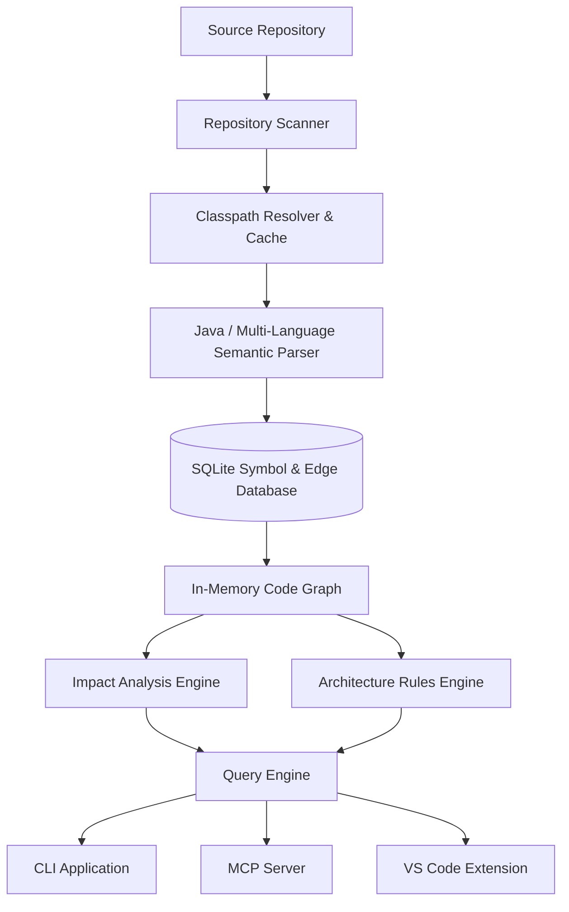

# RepoMind Architecture & Subsystem Guide

RepoMind is a high-performance, deterministic codebase intelligence engine designed for AI coding agents and human engineers. It provides semantic indexing, accurate call graph construction, transitive blast-radius impact analysis, and architecture boundary enforcement.

## Architectural Overview

## Subsystem Breakdown

### 1. Repository Discovery & Classpath Resolution
- `core/scanner`: Detects build systems (Maven, Gradle Kotlin/Groovy DSL) and multi-module subprojects. Applies `.gitignore` rules and security path bounds via `PathGuard`.
- `core/classpath`: Resolves Maven/Gradle classpaths, manages local caching in `.repomind/cache`, and executes build tools defensively with `SafeArgs`.

### 2. Semantic Analysis & Language Processing
- `language/java`: Uses JavaParser and JavaParserFacade with CombinedTypeSolver to extract:
  - Classes, interfaces, records, enums, annotations, method signatures, return types, and fields.
  - Call graph edges with `callerMember` tracking down to method level.
  - Spring-aware polymorphic dispatch: `@Qualifier` / `@Named` disambiguation, constructor injection resolution, and bean wiring.
  - Dynamic dispatch / reflection detection (`Method.invoke`, `Constructor.newInstance`, `Class.forName`).
  - MapStruct mapper interfaces (`@Mapper`) connecting DTOs and entities via `USES` edges.
  - Test-to-production mapping excluding mocked components (`@Mock`, `@MockBean`, `@SpyBean`).

### 3. Persistent Storage
- `storage/sqlite`: Highly optimized embedded SQLite database with WAL mode storing:
  - `modules`: Registered repository modules.
  - `files`: File paths, SHA-256 hashes, and last index timestamps.
  - `symbols`: FQN, parent FQN, kind, signature hash, visibility, annotations, file paths, line ranges.
  - `edges` & `symbol_references`: Source FQN, target FQN, kind (`CALLS`, `USES`, `IMPORTS`, `EXTENDS`, `IMPLEMENTS`, `TESTS`), confidence (`CONFIRMED`, `POSSIBLE`), and source code line number.
  - `unresolved_symbols`: Diagnostic tracking of unresolvable symbols with specific failure reasons.

### 4. Graph & Intelligence Engines
- `core/graph`: Adjacency representation providing transitive caller traversal, transitive callee traversal, dynamic dispatch detection, and test coverage reachability.
- `core/impact`: Deterministic risk scoring (0–100) and blast radius calculation (affected methods, classes, tests, modules). Categorizes certain vs possible callers and maps affected Spring bean configuration wiring.
- `core/rules`: Declarative architecture rules engine loading `.repomind/rules.yaml`. Validates dependencies against stereotype patterns and reports violations with exact file paths and source line numbers.

### 5. Applications & Integration
- `apps/cli`: Command-line interface offering `index`, `query`, `impact`, `rules`, and `report`.
- `apps/mcp-server`: JSON-RPC 2.0 stdio MCP server for AI agents (Claude, Cursor, Antigravity) with token-optimized compact outputs and full query toolsets.
- `apps/vscode-extension`: Thin VS Code integration providing symbol impact queries, workspace re-indexing, and real-time architectural diagnostics in the editor.
